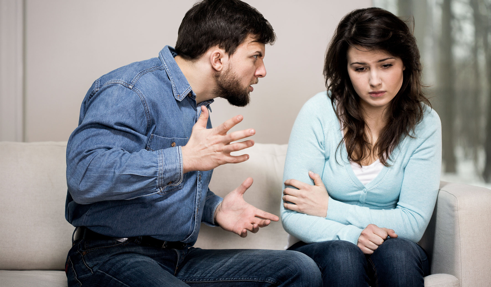

# La violencia
## ¿Es necesaria la violencia?
Para poder empezar de lleno hablando de si es necesaria o no, es esencial saber que es la violencia _La violencia son aquellos actos que tengan que ver con el ejercicio de una fuerza verbal o física sobre otra persona, animal u objeto y que tenga por resultado la generación de un daño sobre esa persona u objeto de manera voluntaria o accidental.-[EcuRed, 2018](https://www.ecured.cu/Violencia)_

La violencia es el abuso de poder, ya que mientras más poder y control se tiene más violencia se puede generar, aunque también hay ocasiones en que la violencia ocurre también de abajo hacia arriba, como por ejemplo, una ama de casa que le exige dinero a su esposo y hace que trabaje horas extra. Al practicar la violencia, se falta al respeto hacia quien o quienes se le esté haciendo.

Existen tipos de violencia, entre las más comunes esta la familiar o doméstica, donde puede ser física o psicológica y ocurre en todas las clases sociales, porque se genera con la violencia el poder y el control en la casa, en la mayoría de los casos sucede por la falta de sustento económico y eso provoca una dependencia, lo que hace que sea más difícil separarse de la pareja. Muchas veces las personas que sufren esto se lo callan por miedo, vergüenza, hasta en ciertas situaciones llegan a perder la vida sin contarle a nadie su secreto.

El cual se constituye en un dibujo tan simple como este, donde los sentimientos emulan el sótano y se ocultan en lo más profundo. 
Todo empieza en el hogar y se lleva hacia la sociedad, hiriendo a la gente más cercana que se puede encontrar y con la que se abusara de su posición de poder, un ejemplo sería que un padre de familia es despedido d su trabajo, y llegando a su casa le pega a su esposa y ella regaña al niño por cualquier motivo, este niño al ir a la escuela puede provocar el bullying sin saber el motivo aparente se la generación de violencia, y en el futuro les ocurrirá lo mismo si no hacen lo ideal, si no lo hacen provocaran un ciclo sin fin en el que la violencia es esencial para tener el control.

Las personas se desquitan con otras, por decirlo así, no conocen otras formas de arreglar sus problemas sin violencia usando las palabras y sin aliviar el dolor dañando a las personas. Las cosas se pueden solucionar hablando con la generadora del problema y para no ser los generadores de violencia podemos hacer actividades que nos ayuden a controlar los impulsos de intentar lastimar a alguien.
Las personas que generan violencia lo hacen porque no conocen otra manera de liberar lo que tienen contenido y no quieren sentirse débiles dejando a flote sus sentimientos, ya que siente que su poder y control está en juego y podrían perderlo por ser sensibles.

No es necesaria la violencia, solo que esta muy arraigada en nuestra sociedad, es muy difícil pero no es imposible, solo que la falta de comunicación provoca que se impida la completa comprensión de los problemas que deben afrontar. 
La ira se puede lidiar con los siguientes pasos:

1. Identifica el problema (autoconciencia). Comienza por observar qué te hace enojar y por qué. Pon en palabras lo que te hace alterar para que puedas actuar en lugar de reaccionar.

2. Piensa en posibles soluciones antes de responder (autocontrol). Aquí es donde te detienes por un minuto para darte tiempo a fin de controlar tu enojo. También es donde empiezas a pensar en cómo podrías reaccionar, pero sin reaccionar aún.

3. Considera las consecuencias de cada solución (piénsalo bien). Aquí es donde piensas acerca de cuál es el resultado probable de cada una de las diferentes reacciones que te planteaste.

4. Toma una decisión (escoge una de las opciones). Aquí es donde actúas al elegir una de las tres cosas que podrías hacer. Observa la lista que realizaste y escoge la opción que probablemente sea la más eficaz.

5. Revisa tu progreso. Después de que hayas actuado y la situación haya finalizado, dedica algo de tiempo a pensar sobre cómo estuvo.
Otras maneras de resolver los problemas de la ira puede ser hacer ejercicio, escuchar música, escribir acerca de ello, dibujar, meditar o respirar profundamente, hablar con alguien de confianza y distraerse viendo la TV, leer libros o ir al cine para despejarse de lo que está pasando. Todo esto te ayuda a controlar cuando sientes que vas a explotar y el enojo en general.

_[(TeensHealth, 2015)](https://kidshealth.org/es/teens/deal-with-anger-esp.html)_

.

### Referencias
* <https://www.ecured.cu/Violencia>

* <https://kidshealth.org/es/teens/deal-with-anger-esp.html>
